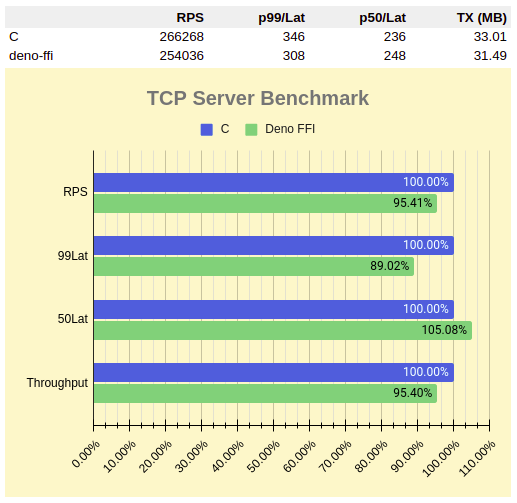
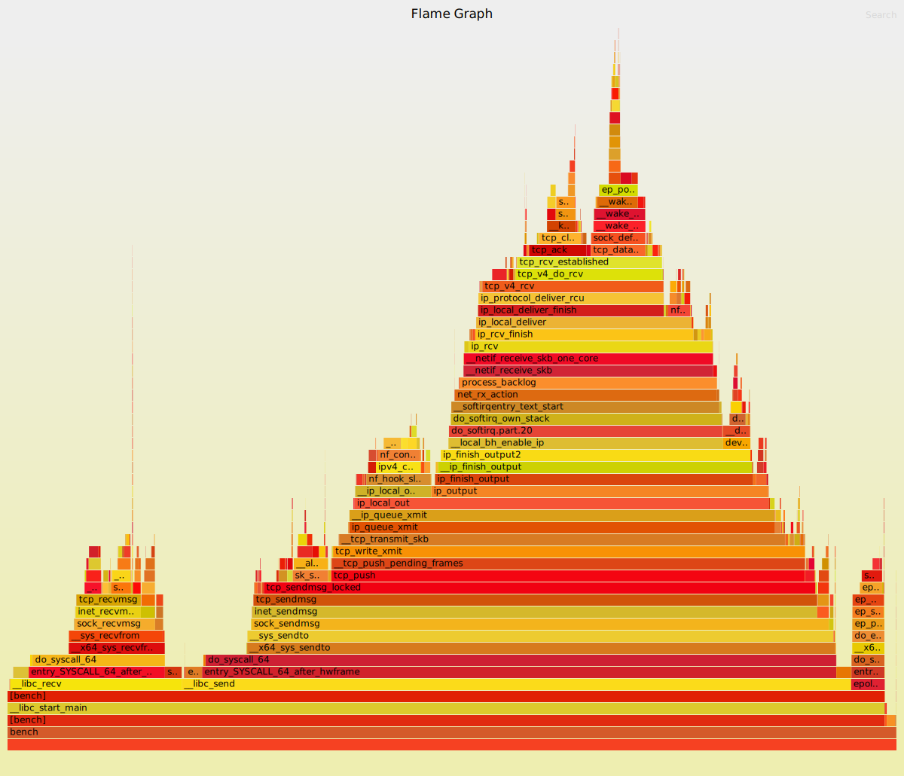
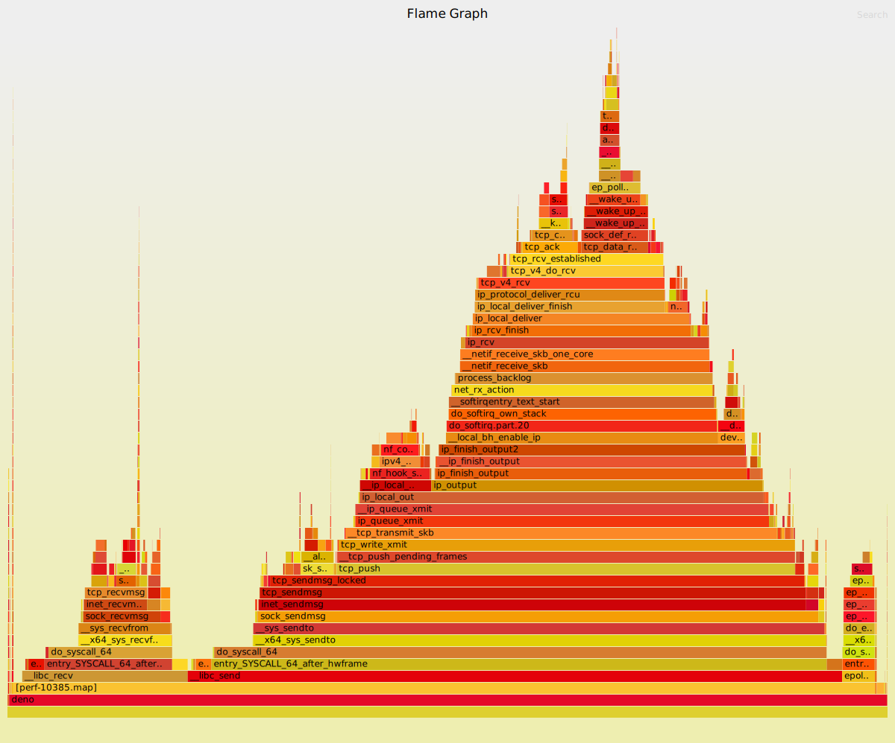

## load test

```
wrk -c 64 -t 2 -d 30 --latency http://127.0.0.1:3000/
```

## bench.c

```
Running 30s test @ http://127.0.0.1:3000/
  2 threads and 64 connections
  Thread Stats   Avg      Stdev     Max   +/- Stdev
    Latency   237.67us  133.41us   9.67ms   99.00%
    Req/Sec   133.85k     8.34k  157.38k    84.67%
  Latency Distribution
     50%  236.00us
     75%  240.00us
     90%  243.00us
     99%  346.00us
  7989149 requests in 30.00s, 0.97GB read
Requests/sec: 266268.73
Transfer/sec:     33.01MB
```

## bench.js
```
Running 30s test @ http://127.0.0.1:3000/
  2 threads and 64 connections
  Thread Stats   Avg      Stdev     Max   +/- Stdev
    Latency   248.75us  132.80us  16.20ms   99.15%
    Req/Sec   127.89k     7.91k  168.22k    86.36%
  Latency Distribution
     50%  248.00us
     75%  253.00us
     90%  258.00us
     99%  308.00us
  7646444 requests in 30.10s, 0.93GB read
Requests/sec: 254036.39
Transfer/sec:     31.49MB
```

## results



## c flamegraph

[view](c-perf.svg)



## deno flamegraph

[view](deno-perf.svg)



